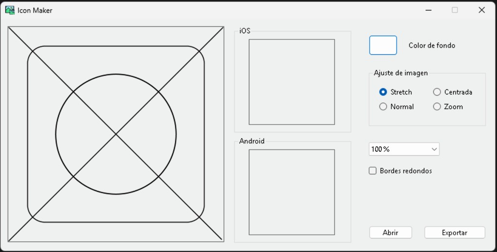
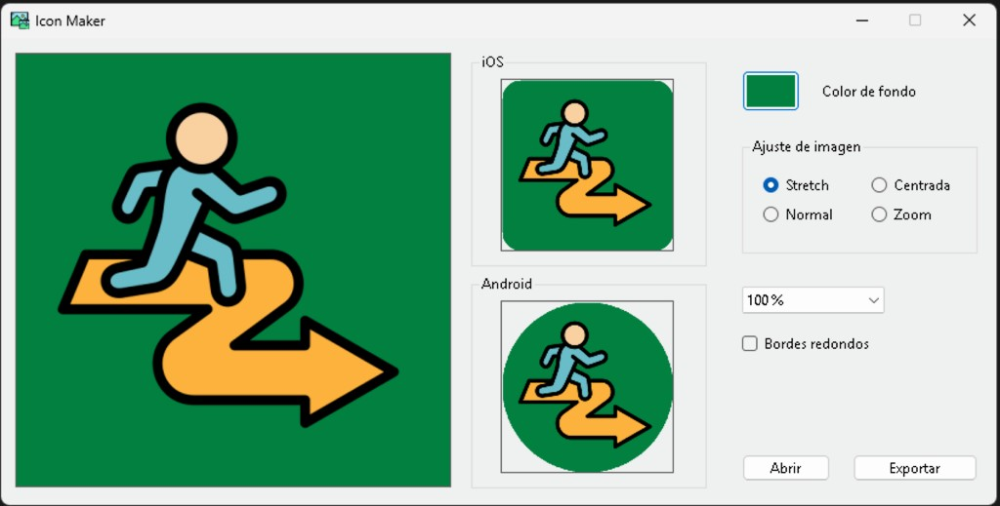
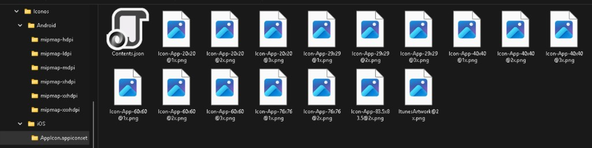
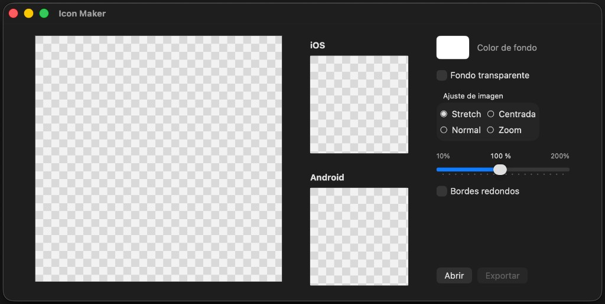
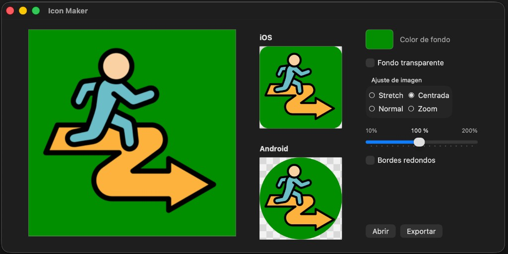
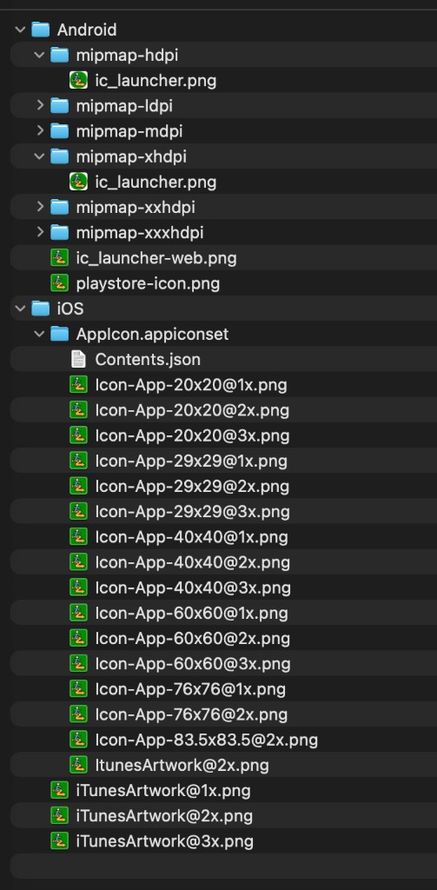

# JohnnyIconMaker

## ☕ Apoya el proyecto

JohnnyIconMaker es un proyecto independiente desarrollado en mi tiempo libre. Si te late o te resulta útil, un café de **1 USD** ayuda a seguir mejorándolo y, de paso, también me acerca un poco más a resolver algunos retos personales (como mi hipoteca 😁).

👉 [Invítame un café (PayPal)](https://paypal.me/SIPTecMX)

⭐ Una estrella en GitHub también hace una gran diferencia.

---

Genera el set completo de iconos para **iOS** y **Android** a partir de una sola imagen.

Por [Johnny Sánchez / CreateIT](https://www.createit.com.mx) · [JohnnyC-SH](https://github.com/JohnnyC-SH)

> **Este repositorio es de descargas y documentación.**  
> Contiene binarios, capturas y licencia de **uso**. El código fuente no se publica aquí.

## Descargas

| Plataforma | Archivo | Estado |
|---|---|---|
| **Windows** | [`JohnnyIconMaker.rar`](downloads/JohnnyIconMaker.rar) | Disponible |
| **macOS** | [`JohnnyIconMaker-macOS.dmg`](downloads/JohnnyIconMaker-macOS.dmg) | Disponible |

**Windows:** descarga el `.rar`, extráelo y ejecuta `IconMaker.exe` (requiere [.NET 6 Desktop Runtime](https://dotnet.microsoft.com/download/dotnet/6.0) si no lo tienes).

**macOS:** abre el `.dmg`, arrastra **Johnny Icon Maker** a Aplicaciones. Build **Universal** (Intel + Apple Silicon). La primera vez macOS puede pedir permiso en Privacidad y seguridad (firma local de desarrollo).

## ¿Qué hace?

1. Abres una imagen (PNG/JPG).
2. Ajustas fondo, escala, centrado / stretch / zoom y bordes.
3. Previsualizas máscaras **iOS** y **Android**.
4. Exportas el paquete listo para Xcode / Android Studio.

### Capturas

#### Windows

**Vacío**

**Con imagen (previews iOS / Android)**

**Exportación (mipmaps Android + AppIcon iOS)**

#### macOS

**Vacío**

**Con imagen (previews iOS / Android)**

**Exportación (mipmaps Android + AppIcon iOS)**

## Licencia de uso

Uso **personal / sin fines de lucro**: gratis (ver [`LICENSE-USE.md`](LICENSE-USE.md)).

Uso **comercial / empresarial**: requiere licencia — escríbeme o usa PayPal y avísame: [paypal.me/SIPTecMX](https://paypal.me/SIPTecMX).

## Más proyectos de Johnny Sánchez

| Proyecto | Qué es |
|---|---|
| [JohnnyMsgBox](https://github.com/JohnnyC-SH/JohnnyMsgBox) | MessageBox / diálogos / toasts para Blazor y HTML |
| [DotNet Convenience](https://github.com/JohnnyC-SH/DotNet_convenience) | Extensión VS Code / Cursor para flujos .NET |
| [create.it](https://www.createit.com.mx) | Sitio y marca CreateIT |
